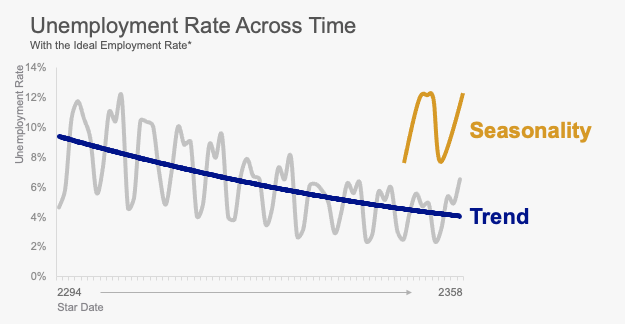
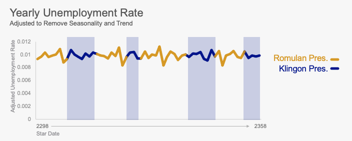

# Recreating charts in R

In 2016, I created charts in PowerPoint. In 2020, I showed these charts to students. They challenged me to recreate these charts in R. Challenge accepted.

## Organize the Data

Most of the charts are based on the raw monthly employment and unemployment quantities, so I combined these into a single file for use in the plots. I've also used the `lubridate` package to make the year and month time series data.

```{r message=F, warning=F}
library(tidyverse)
library(lubridate)
employed <- read_csv("../Week 7 - R Markdown/Homework Data/Employment.csv")
unemployed <- read_csv("../Week 7 - R Markdown/Homework Data/Unemployment.csv")

employed <- employed %>%
  select(-`Annual Average`) %>%
  pivot_longer(-`Star Year`, names_to = "Star Month", values_to = "employed_number") %>%
  mutate(date = ymd(paste0(`Star Year`,"-",`Star Month`,"-","01"))) %>%
  select(date, employed_number)

plot_data <- unemployed %>%
  select(-`Annual Average`) %>%
  pivot_longer(-`Star Year`, names_to = "Star Month", values_to = "unemployed_number") %>%
  mutate(date = ymd(paste0(`Star Year`,"-",`Star Month`,"-","01"))) %>%
  select(date, unemployed_number) %>%
  full_join(employed)

plot_data
```

## Recreate Chart 1

Here is chart 1:


Let's create the bones of the chart. I've used 2 `geom_area` geoms layer one over the other as opposed to a single geom with `fill` as an aesthetic.

```{r}
ggplot(plot_data, aes(x=date)) + 
  geom_area(aes(y=employed_number)) + 
  geom_area(aes(y=unemployed_number), fill = "blue")
```

Now let's choose the same colors and fix the lable text. Let's also scale the numbers to be in thousands by dividing everything by 1000.

```{r}
ggplot(plot_data, aes(x=date)) + 
  geom_area(aes(y=employed_number/1000), fill = "#9F9F9F") + 
  geom_area(aes(y=unemployed_number/1000), fill = "#000197") +
  labs(title = "Total Population Across Time",
       subtitle = "In Thousands; Broken out by Employed and Unemployed",
       y = "Population in Thousands",
       x = "Star Date")
```

Now let's fix the scales so they match the original. `ggplot` loves the hovering data, so I use `expand = c(0,0)` in both the x and y axis to bring it flush with the axis. I also use a hack by adding some spaces to push the dates over.

```{r}
ggplot(plot_data, aes(x=date)) + 
  geom_area(aes(y=employed_number/1000), fill = "#9F9F9F") + 
  geom_area(aes(y=unemployed_number/1000), fill = "#000197") + 
  labs(title = "Total Population Across Time",
       subtitle = "In Thousands; Broken out by Employed and Unemployed",
       y = "Population in Thousands",
       x = "Star Date") + 
  scale_y_continuous(expand = c(0, 0), breaks = seq(0,160, by = 20)) + 
  scale_x_continuous(expand = c(0, 0), breaks = c(ymd("2294-01-01"), ymd("2358-12-01")), labels = c("       2294", "2358       ")) 
```

Now let's work on the theme. I'll start with the `theme_minial()` and make adjustments from there. A couple things need to be done.

* All the text should be Arial
* The title and subtitle should be dark grey, all other text light grey
* The title should be font size 24, everything else should be 12
* The x-axis title should be right aligned, and the y-axis title should be top aligned
* Move the title to be flush with the edge of the plot, not the edge of the data
* Add the axis lines and ticks for the x-axis

```{r}
ggplot(plot_data, aes(x=date)) + 
  geom_area(aes(y=employed_number/1000), fill = "#9F9F9F") + 
  geom_area(aes(y=unemployed_number/1000), fill = "#000197") + 
  labs(title = "Total Population Across Time",
       subtitle = "In Thousands; Broken out by Employed and Unemployed",
       y = "Population in Thousands",
       x = "Star Date") + 
  scale_y_continuous(expand = c(0, 0), breaks = seq(0,160, by = 20)) + 
  scale_x_continuous(expand = c(0, 0), breaks = c(ymd("2294-01-01"), ymd("2358-12-01")), labels = c("       2294", "2358       ")) + 
  theme_minimal() + 
  theme(text = element_text(family = "Arial", color = "#5F5F5F", size = 12),
        plot.title = element_text(size = 24),
        plot.subtitle = element_text(size = 12),
        plot.title.position = "plot",
        axis.title.x = element_text(hjust = 0, color = "#9F9F9F"),
        axis.title.y = element_text(hjust = 1, color = "#9F9F9F"),
        axis.text = element_text(color = "#9F9F9F", size = 12), 
        axis.line.y = element_line(color = "#9F9F9F", size = .25),
        panel.grid = element_blank(),
        axis.ticks.x = element_line(color = "#9F9F9F", size = .25)) 
```

Looks like there is a bit of space between the title and subtitle. I'll fiddle with the margins to take care of that.


```{r}
ggplot(plot_data, aes(x=date)) + 
  geom_area(aes(y=employed_number/1000), fill = "#9F9F9F") + 
  geom_area(aes(y=unemployed_number/1000), fill = "#000197") + 
  labs(title = "Total Population Across Time",
       subtitle = "In Thousands; Broken out by Employed and Unemployed",
       y = "Population in Thousands",
       x = "Star Date") + 
  scale_y_continuous(expand = c(0, 0), breaks = seq(0,160, by = 20)) + 
  scale_x_continuous(expand = c(0, 0), breaks = c(ymd("2294-01-01"), ymd("2358-12-01")), labels = c("       2294", "2358       ")) + 
  theme_minimal() + 
  theme(text = element_text(family = "Arial", color = "#5F5F5F", size = 12),
        plot.title = element_text(size = 24, margin=margin(0,0,0,0)),
        plot.subtitle = element_text(size = 12, margin=margin(0,0,20,0)),
        plot.title.position = "plot",
        axis.title.x = element_text(hjust = 0, color = "#9F9F9F"),
        axis.title.y = element_text(hjust = 1, color = "#9F9F9F"),
        axis.text = element_text(color = "#9F9F9F", size = 12), 
        axis.line.y = element_line(color = "#9F9F9F", size = .25),
        panel.grid = element_blank(),
        axis.ticks.x = element_line(color = "#9F9F9F", size = .25)) 
```

There is no legend in the plot as I had labeled the data directly. I can use `annotate` to add this. It take some time to get the x and y coordinates just right.

```{r}
ggplot(plot_data, aes(x=date)) + 
  geom_area(aes(y=employed_number/1000), fill = "#9F9F9F") + 
  geom_area(aes(y=unemployed_number/1000), fill = "#000197") + 
  annotate("text", x = ymd("2354-10-01"), y = 130, label = "Employed", color = "white", family = "Arial") +
  annotate("text", x = ymd("2354-1-01"), y = 25, label = "Unemployed", color = "white", family = "Arial") +
  labs(title = "Total Population Across Time",
       subtitle = "In Thousands; Broken out by Employed and Unemployed",
       y = "Population in Thousands",
       x = "Star Date") + 
  scale_y_continuous(expand = c(0, 0), breaks = seq(0,160, by = 20)) + 
  scale_x_continuous(expand = c(0, 0), breaks = c(ymd("2294-01-01"), ymd("2358-12-01")), labels = c("       2294", "2358       ")) + 
  theme_minimal() + 
  theme(text = element_text(family = "Arial", color = "#5F5F5F", size = 12),
        plot.title = element_text(size = 24, margin=margin(0,0,0,0)),
        plot.subtitle = element_text(size = 12, margin=margin(0,0,20,0)),
        plot.title.position = "plot",
        axis.title.x = element_text(hjust = 0, color = "#9F9F9F"),
        axis.title.y = element_text(hjust = 1, color = "#9F9F9F"),
        axis.text = element_text(color = "#9F9F9F", size = 12), 
        axis.line.y = element_line(color = "#9F9F9F", size = .25),
        panel.grid = element_blank(),
        axis.ticks.x = element_line(color = "#9F9F9F", size = .25)) 
```

It took quite a bit of Googling to figure out how to add this arrow, but I did it with an `annotation` and was able to move it outside of the data with `coord_cartesian(clip = "off")`

```{r}
ggplot(plot_data, aes(x=date)) + 
  geom_area(aes(y=employed_number/1000), fill = "#9F9F9F") + 
  geom_area(aes(y=unemployed_number/1000), fill = "#000197") + 
  annotate("text", x = ymd("2354-10-01"), y = 130, label = "Employed", color = "white", family = "Arial") +
  annotate("text", x = ymd("2354-1-01"), y = 25, label = "Unemployed", color = "white", family = "Arial") +
  annotate("segment" , x = ymd("2299-1-01"), xend = ymd("2354-1-01"), y = -7, yend = -7, arrow = arrow( type = "closed", length = unit(5, "pt")), color = "#9F9F9F") +
  labs(title = "Total Population Across Time",
       subtitle = "In Thousands; Broken out by Employed and Unemployed",
       y = "Population in Thousands",
       x = "Star Date") + 
  scale_y_continuous(expand = c(0, 0), breaks = seq(0,160, by = 20)) + 
  scale_x_continuous(expand = c(0, 0), breaks = c(ymd("2294-01-01"), ymd("2358-12-01")), labels = c("       2294", "2358       ")) + 
  theme_minimal() + 
  theme(text = element_text(family = "Arial", color = "#5F5F5F", size = 12),
        plot.title = element_text(size = 24, margin=margin(0,0,0,0)),
        plot.subtitle = element_text(size = 12, margin=margin(0,0,20,0)),
        plot.title.position = "plot",
        axis.title.x = element_text(hjust = 0, color = "#9F9F9F"),
        axis.title.y = element_text(hjust = 1, color = "#9F9F9F"),
        axis.text = element_text(color = "#9F9F9F", size = 12), 
        axis.line.y = element_line(color = "#9F9F9F", size = .25),
        panel.grid = element_blank(),
        axis.ticks.x = element_line(color = "#9F9F9F", size = .25)) + 
  coord_cartesian(ylim=c(0,150), clip = "off")
```

How does this compare to the original? Looks like something was incorrect in my original data set - opps.


## Umployement Rate Over Time

This chart it similiar so we can reuse many of the same theme elements.



For this chart we need to create the unemployement rate and then smooth it using a rolling average for the trend line. The `slider` package helps with the moving average.

```{r}
library(slider)
plot_data2 <- plot_data %>%
  mutate(unemployment_rate = unemployed_number / (unemployed_number + employed_number)) %>%
  mutate(moving_ave = slide_dbl(unemployment_rate, mean, .before = 2.5*12, .after = 2.5*12))
plot_data2
```

Now I can create the base chart.

```{r}
ggplot(plot_data2, aes(x=date)) + 
  geom_line(aes(y = unemployment_rate)) +
  geom_line(aes(y = moving_ave))
```

Now let's add in the theme elements from the previous chart. If I wanted to be parsimonious, I would save this as a theme object itself for use in other figures.

```{r}
ggplot(plot_data2, aes(x=date)) + 
  geom_line(aes(y = unemployment_rate), color = "#9F9F9F", size = 1) +
  geom_line(aes(y = moving_ave), color = "#DBA401", size = 1) +
  annotate("segment" , x = ymd("2299-1-01"), xend = ymd("2354-1-01"), y = -.005, yend = -.005,
           arrow = arrow( type = "closed", length = unit(5, "pt")), color = "#9F9F9F") +
  labs(title = "Unemployment Rate Across Time",
       subtitle = "With 5-year Moving Average Trend Line",
       y = "Unemployment Rate",
       x = "Star Date") + 
  scale_y_continuous(expand = c(0, 0), seq(0,12, by = .02)) + 
  scale_x_continuous(expand = c(0, 0), breaks = c(ymd("2294-01-01"), ymd("2358-12-01")), labels = c("       2294", "2358       ")) + 
  theme_minimal() + 
  theme(text = element_text(family = "Arial", color = "#5F5F5F", size = 12),
        plot.title = element_text(size = 24, margin=margin(0,0,0,0)),
        plot.subtitle = element_text(size = 12, margin=margin(0,0,20,0)),
        plot.title.position = "plot",
        axis.title.x = element_text(hjust = 0, color = "#9F9F9F"),
        axis.title.y = element_text(hjust = 1, color = "#9F9F9F"),
        axis.text = element_text(color = "#9F9F9F", size = 12), 
        axis.line.y = element_line(color = "#9F9F9F", size = .25),
        axis.line.x = element_line(color = "#9F9F9F", size = .25),
        panel.grid = element_blank(),
        axis.ticks.x = element_line(color = "#9F9F9F", size = .25)) + 
  coord_cartesian(ylim=c(0,.13), clip = "off")
```

Then I added in the tick marks, but this requires adjusting both the `breaks` and the `labels` in the `scale_x_continuous` to be an equal number. I created a sequence of all the years, then a vector of the first and last date and null values in between.

Lastly, I added the `annation` for the lines which also required changing the xlim in the `coord_cartesian` for the same reason as adding the arrow below the x-axis.


```{r}
ggplot(plot_data2, aes(x=date)) + 
  geom_line(aes(y = unemployment_rate), color = "#9F9F9F", size = 1) +
  geom_line(aes(y = moving_ave), color = "#DBA401", size = 1) +
  annotate("segment" , x = ymd("2299-1-01"), xend = ymd("2354-1-01"), y = -.005, yend = -.005,
           arrow = arrow( type = "closed", length = unit(5, "pt")), color = "#9F9F9F") +
  annotate("text", x = ymd("2360-10-01"), y = .075, label = "Unemployment", color = "#9F9F9F", family = "Arial", hjust = 0) +
  annotate("text", x = ymd("2360-10-01"), y = .09, label = "Trend", color = "#DBA401", family = "Arial", hjust = 0) +
  labs(title = "Unemployment Rate Across Time",
       subtitle = "With 5-year Moving Average Trend Line",
       y = "Unemployment Rate",
       x = "Star Date") + 
  scale_y_continuous(expand = c(0, 0), breaks = seq(0,12, by = .02), labels = scales::percent_format(1)) + 
  scale_x_continuous(expand = c(0, 0), breaks = (seq(ymd("2294-01-01"), ymd("2358-12-01"), by = "years")), labels = c("       2294",rep("",63), "2358       ")) + 
  theme_minimal() + 
  theme(text = element_text(family = "Arial", color = "#5F5F5F", size = 12),
        plot.title = element_text(size = 24, margin=margin(0,0,0,0)),
        plot.subtitle = element_text(size = 12, margin=margin(0,0,20,0)),
        plot.title.position = "plot",
        axis.title.x = element_text(hjust = 0, color = "#9F9F9F"),
        axis.title.y = element_text(hjust = 1, color = "#9F9F9F"),
        axis.text = element_text(color = "#9F9F9F", size = 12), 
        axis.line.y = element_line(color = "#9F9F9F", size = .25),
        axis.line.x = element_line(color = "#9F9F9F", size = .25),
        panel.grid = element_blank(),
        axis.ticks.x = element_line(color = "#9F9F9F", size = .25),
        plot.margin = margin(10, 90, 10, 10)) + 
  coord_cartesian(ylim=c(0,.13), clip = "off",
                  xlim=c(ymd("2294-01-01"), ymd("2358-12-01")))
```

How does this look?


## Adjusted Unemployment for Seasonality and Trend



This final chart removes seasonality and trend from the line. Without going into the data science details, I found a package that takes care of this in a simple `dplyr`-friendly function.

```{r warning = F}
library(anomalize)
party <- read_csv("../Week 7 - R Markdown/Homework Data/PartyControl.csv")
party <- party %>%
  select(`Star Year`, President) %>%
  mutate(President = ifelse(President == "R","Romulan Pres.","Klingon Pres."))

plot_data3 <- plot_data2 %>% 
  time_decompose(unemployment_rate) %>%
  mutate(`Star Year` = year(date)) %>%
  left_join(party) 
plot_data3
```

Now I'll create the base chart and add the theme elements from the earlier charts. I had to move the annoation down and adjust the scales a bit.

```{r}
ggplot(plot_data3, aes(x=date)) + 
  geom_line(aes(y = remainder), size = 1) +
  annotate("segment" , x = ymd("2299-1-01"), xend = ymd("2354-1-01"), y = -.0125, yend = -.0125,
           arrow = arrow( type = "closed", length = unit(5, "pt")), color = "#9F9F9F") +
  labs(title = "Yearly Unemployment Rate",
       subtitle = "Adjusted to Remove Seasonality and Trend",
       y = "Adjusted Unemployment Rate",
       x = "Star Date") + 
  scale_y_continuous(expand = c(0, 0), breaks = seq(0,1, by = .01), labels = scales::percent_format(1)) + 
  scale_x_continuous(expand = c(0, 0), breaks = (seq(ymd("2294-01-01"), ymd("2358-12-01"), by = "years")), labels = c("       2294",rep("",63), "2358       ")) + 
  theme_minimal() + 
  theme(text = element_text(family = "Arial", color = "#5F5F5F", size = 12),
        plot.title = element_text(size = 24, margin=margin(0,0,0,0)),
        plot.subtitle = element_text(size = 12, margin=margin(0,0,20,0)),
        plot.title.position = "plot",
        axis.title.x = element_text(hjust = 0, color = "#9F9F9F"),
        axis.title.y = element_text(hjust = 1, color = "#9F9F9F"),
        axis.text = element_text(color = "#9F9F9F", size = 12), 
        axis.line.y = element_line(color = "#9F9F9F", size = .25),
        axis.line.x = element_line(color = "#9F9F9F", size = .25),
        panel.grid = element_blank(),
        axis.ticks.x = element_line(color = "#9F9F9F", size = .25),
        plot.margin = margin(10, 90, 10, 10)) + 
  coord_cartesian(ylim=c(-.01,.05), clip = "off")
```

Now let's add the colors for the different presidents in power. The trick here is to add the `group = 1` in the aesthetic so the lines connect. This also requires adding the scale values for the colors.

```{r}
ggplot(plot_data3, aes(x=date)) + 
  geom_line(aes(y = remainder, color = President, group = 1), size = 1) +
  annotate("segment" , x = ymd("2299-1-01"), xend = ymd("2354-1-01"), y = -.0125, yend = -.0125,
           arrow = arrow( type = "closed", length = unit(5, "pt")), color = "#9F9F9F") +
  labs(title = "Yearly Unemployment Rate",
       subtitle = "Adjusted to Remove Seasonality and Trend",
       y = "Adjusted Unemployment Rate",
       x = "Star Date") + 
  scale_y_continuous(expand = c(0, 0), breaks = seq(0,1, by = .01), labels = scales::percent_format(1)) + 
  scale_x_continuous(expand = c(0, 0), breaks = (seq(ymd("2294-01-01"), ymd("2358-12-01"), by = "years")), labels = c("       2294",rep("",63), "2358       ")) + 
  scale_color_manual(values = c("#000197", "#DBA401")) + 
  theme_minimal() + 
  theme(text = element_text(family = "Arial", color = "#5F5F5F", size = 12),
        plot.title = element_text(size = 24, margin=margin(0,0,0,0)),
        plot.subtitle = element_text(size = 12, margin=margin(0,0,20,0)),
        plot.title.position = "plot",
        axis.title.x = element_text(hjust = 0, color = "#9F9F9F"),
        axis.title.y = element_text(hjust = 1, color = "#9F9F9F"),
        axis.text = element_text(color = "#9F9F9F", size = 12), 
        axis.line.y = element_line(color = "#9F9F9F", size = .25),
        axis.line.x = element_line(color = "#9F9F9F", size = .25),
        panel.grid = element_blank(),
        axis.ticks.x = element_line(color = "#9F9F9F", size = .25),
        plot.margin = margin(10, 90, 10, 10)) + 
  coord_cartesian(ylim=c(-.01,.05), clip = "off")
```

Lastly, I adjust the theme elements for the legend and add in the light blue boxes.

```{r}
ggplot(plot_data3, aes(x=date)) + 
  geom_line(aes(y = remainder, color = President, group = 1), size = 1) +
  annotate("segment" , x = ymd("2299-1-01"), xend = ymd("2354-1-01"), y = -.0125, yend = -.0125,
           arrow = arrow( type = "closed", length = unit(5, "pt")), color = "#9F9F9F") +
  labs(title = "Yearly Unemployment Rate",
       subtitle = "Adjusted to Remove Seasonality and Trend",
       y = "Adjusted Unemployment Rate",
       x = "Star Date") + 
  scale_y_continuous(expand = c(0, 0), breaks = seq(0,1, by = .01), labels = scales::percent_format(1)) + 
  scale_x_continuous(expand = c(0, 0), breaks = (seq(ymd("2294-01-01"), ymd("2358-12-01"), by = "years")), labels = c("       2294",rep("",63), "2358       ")) + 
  scale_color_manual(values = c("#000197", "#DBA401")) + 
  theme_minimal() + 
  theme(text = element_text(family = "Arial", color = "#5F5F5F", size = 12),
        plot.title = element_text(size = 24, margin=margin(0,0,0,0)),
        plot.subtitle = element_text(size = 12, margin=margin(0,0,20,0)),
        plot.title.position = "plot",
        axis.title.x = element_text(hjust = 0, color = "#9F9F9F"),
        axis.title.y = element_text(hjust = 1, color = "#9F9F9F"),
        axis.text = element_text(color = "#9F9F9F", size = 12), 
        axis.line.y = element_line(color = "#9F9F9F", size = .25),
        axis.line.x = element_line(color = "#9F9F9F", size = .25),
        panel.grid = element_blank(),
        axis.ticks.x = element_line(color = "#9F9F9F", size = .25),
        plot.margin = margin(10, 90, 10, 10),
        legend.title = element_blank(), 
        legend.text = element_text(family = "Arial")) + 
  coord_cartesian(ylim=c(-.01,.05), clip = "off")
```