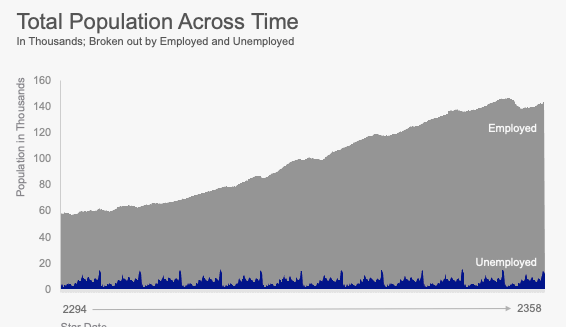

# Recreating Chart 1

```{r}
library(tidyverse)
library(lubridate)
employed <- read_csv("../Week 7 - R Markdown/Homework Data/Employment.csv")
unemployed <- read_csv("../Week 7 - R Markdown/Homework Data/Unemployment.csv")

employed <- employed %>%
  select(-`Annual Average`) %>%
  pivot_longer(-`Star Year`, names_to = "Star Month", values_to = "employed_number") %>%
  mutate(date = ymd(paste0(`Star Year`, "-", `Star Month`, "-", "01"))) %>%
  select(date, employed_number)

plot_data <- unemployed %>%
  select(-`Annual Average`) %>%
  pivot_longer(-`Star Year`, names_to = "Star Month", values_to = "unemployed_number") %>%
  mutate(date = ymd(paste0(`Star Year`, "-", `Star Month`, "-", "01"))) %>%
  select(date, unemployed_number) %>%
  full_join(employed)

plot_data

```



```{r}

ggplot(plot_data, aes(x = date)) + 
  geom_area(aes(y = employed_number/1000), fill = "#9F9F9F") + 
  geom_area(aes(y = unemployed_number/1000), fill = "#000099") +
  annotate("text", x = ymd("2354-10-01"), y = 120, label = "Employed", color = "white", family = "Arial") +
  annotate("text", x = ymd("2354-01-01"), y = 25, label = "Unmployed", color = "white", family = "Arial") +
  annotate("segment" , x = ymd("2299-1-01"), xend = ymd("2354-1-01"), y = -7, yend = -7, arrow = arrow(type = "closed", length = unit(5, "pt")), color = "#9F9F9F") +
  labs(title = "Total Population Across Time",
       subtitle = "In Thousands; Broken out by Employed and Unemployed",
       y = "Population in Thousands",
       x = "Star Date") +
  scale_y_continuous(expand = c(0,0), breaks = seq(0, 160, by = 20)) + 
  scale_x_continuous(expand = c(0,0), breaks = c(ymd("2294-01-01", ymd("2358-01-01"))), labels = c("        2294", "2358      ")) + 
  theme_minimal() + 
  theme(panel.grid = element_blank(),
        axis.line = element_line(color = "#D6D6D6", size = .25),
        text = element_text(family = "Arial", color = "#5F5F5F", size = 12),
        plot.title = element_text(size = 24, margin = margin(0,0,0,0)),
        plot.subtitle = element_text(margin = margin(0,0,20,0)),
        plot.title.position = "plot",
        axis.title.x = element_text(hjust = 0, color = "#9F9F9F"),
        axis.title.y = element_text(hjust = 1, color = "#9F9F9F"),
        axis.text = element_text(color = "#9F9F9F", size = 12)) + 
  coord_cartesian(ylim = c(0, 150), clip = "off")
  
```


